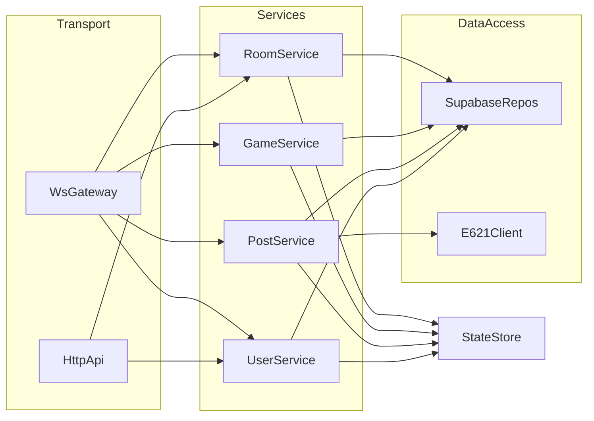

# Backend Architecture

## Goals
- Separate transport (WebSocket + HTTP) from business logic and data access.
- Preserve existing game behavior while making the codebase testable and extensible.
- Provide clear seams for unit testing and future CRUD endpoints.

## Layered Structure

### Transport Layer
- **WebSocket** handles two-way real-time events and delegates to services.
- **HTTP (Express)** handles CRUD-style endpoints.

Key paths:
- `backend/src/transport/ws/wsServer.ts`
- `backend/src/transport/ws/wsRouter.ts`
- `backend/src/transport/http/app.ts`
- `backend/src/transport/http/routes/rooms.ts`

### Business Logic Layer
- Services orchestrate state changes and data access.
- They do not talk directly to sockets or HTTP.

Key paths:
- `backend/src/services/userService.ts`
- `backend/src/services/roomService.ts`
- `backend/src/services/gameService.ts`
- `backend/src/services/postService.ts`
- `backend/src/services/guessService.ts`
- `backend/src/services/sessionService.ts`

### Data Access Layer
- Supabase repositories encapsulate DB I/O.
- External e621 API client lives here.

Key paths:
- `backend/src/data/repos/*`
- `backend/src/data/e621Client.ts`
- `backend/src/data/supabaseClient.ts`

### Shared Domain
- Zod schemas and shared types.
- Pure helpers for room and tag logic.

Key paths:
- `backend/src/domain/contracts.ts`
- `backend/src/domain/roomUtils.ts`
- `backend/src/domain/tagUtils.ts`

### State
- In-memory game state (rooms, users, sockets, active games).

Key path:
- `backend/src/state/store.ts`

## Request Flow Overview

## WebSocket Events vs HTTP Endpoints

### Two-way (WebSocket)
- `CREATE_ROOM`, `JOIN_ROOM`, `LEAVE_ROOM`
- `REQUEST_POST`, `GUESS_TAG`, `READY_UP`
- `SET_USERNAME`, `SET_ICON`, `GET_SELECTED_ICONS`
- `UPDATE_BLACKLIST`, `UPDATE_PREFERLIST`
- `START_GAME`, `END_GAME`, `SHOW_LEADERBOARD`

### CRUD (HTTP)
- `GET /health`
- `GET /rooms`
- `GET /rooms/:roomID`

## Test Strategy
- Unit-test helpers in `domain/` (pure functions).
- Unit-test services with mocked repos.
- Unit-test repository functions with mocked Supabase client.

Example tests:
- `backend/tests/tagUtils.test.ts`
- `backend/tests/roomUtils.test.ts`
- `backend/tests/roomService.test.ts`
