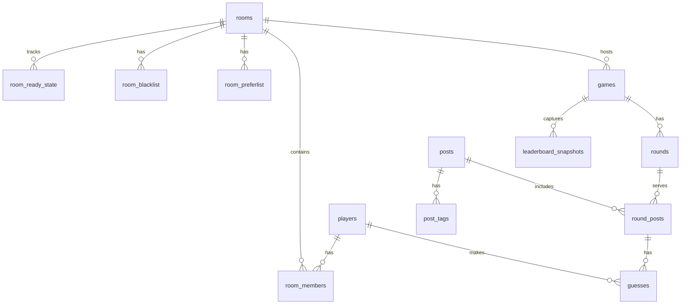

# Database Architecture

```mermaid
erDiagram
  players ||--o{ room_members : has
  rooms ||--o{ room_members : contains
  rooms ||--o{ room_ready_state : tracks
  rooms ||--o{ room_blacklist : has
  rooms ||--o{ room_preferlist : has
  rooms ||--o{ games : hosts
  games ||--o{ rounds : has
  rounds ||--o{ round_posts : serves
  posts ||--o{ post_tags : has
  posts ||--o{ round_posts : includes
  round_posts ||--o{ guesses : has
  players ||--o{ guesses : makes
  games ||--o{ leaderboard_snapshots : captures
```
