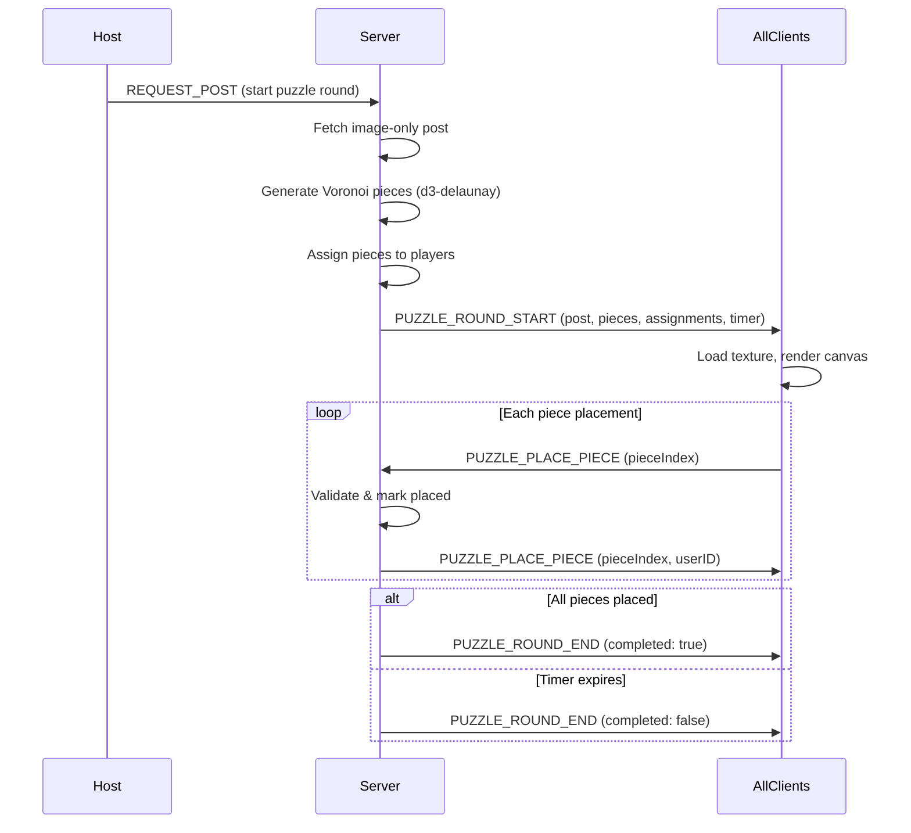

# Puzzle Game Mode Implementation

## Architecture Overview

Puzzle mode is fundamentally different from Blitz/Roulette: it replaces tag guessing with cooperative image assembly. The server generates Voronoi-cut piece definitions, assigns pieces to players, validates placements, manages a countdown timer, and broadcasts state. The client renders pieces using React Three Fiber with custom geometry and texture mapping, handling drag-and-drop via pointer events.




## Phase 1: Types and Contracts

### New Event Types

Add to `EventType` enum in both [backend/src/domain/contracts.ts](backend/src/domain/contracts.ts) and [frontend/src/types.ts](frontend/src/types.ts):

- `PUZZLE_ROUND_START` -- server to client, delivers piece definitions and assignments
- `PUZZLE_PLACE_PIECE` -- bidirectional, piece placement
- `PUZZLE_ROUND_END` -- server to client, round complete or timer expired

### New Zod Schemas (both files)

```typescript
export const PuzzlePieceDefinition = z.object({
  index: z.number(),
  vertices: z.array(z.tuple([z.number(), z.number()])),
  centroid: z.tuple([z.number(), z.number()]),
});

export const PuzzlePieceAssignment = z.object({
  userId: z.string(),
  pieceIndices: z.array(z.number()),
});

export const PuzzleRoundStartEventData = z.object({
  type: z.literal('PUZZLE_ROUND_START'),
  postUrl: z.string(),
  postId: z.number(),
  pieces: z.array(PuzzlePieceDefinition),
  assignments: z.array(PuzzlePieceAssignment),
  timerDurationMs: z.number(),
  roundNumber: z.number(),
  totalRounds: z.number(),
});

export const PuzzlePlacePieceEventData = z.object({
  type: z.literal('PUZZLE_PLACE_PIECE'),
  roomID: z.string(),
  userID: z.string(),
  pieceIndex: z.number(),
});

export const PuzzlePlacePieceEventDataToClient = z.object({
  type: z.literal('PUZZLE_PLACE_PIECE'),
  pieceIndex: z.number(),
  userID: z.string(),
});

export const PuzzleRoundEndEventData = z.object({
  type: z.literal('PUZZLE_ROUND_END'),
  completed: z.boolean(),
  placedPieces: z.array(z.number()),
  totalPieces: z.number(),
});
```

### Room Settings Extension

Add `puzzleTimerSeconds` to `ServerRoom`, `ClientRoom`, `CreateRoomEventData`, and `UpdateRoomSettingsEventData` as an optional field (defaults to 120). Options: 60, 90, 120, 180.

## Phase 2: Backend Puzzle Service

### New file: [backend/src/services/puzzleService.ts](backend/src/services/puzzleService.ts)

**Dependencies**: Install `d3-delaunay` in the backend for Voronoi diagram generation.

**Key functions:**

- `generatePuzzlePieces(numPieces: number, seed: number)` -- generates Voronoi cells in normalized [0,1] x [0,1] space with Lloyd relaxation (2-3 iterations for uniform sizing). Returns `PuzzlePieceDefinition[]`.
- `assignPiecesToPlayers(pieces: PuzzlePieceDefinition[], playerIds: string[])` -- round-robin assignment. Returns `PuzzlePieceAssignment[]`.
- `handlePuzzleRoundStart(roomID: string)` -- orchestrates piece generation, assignment, and broadcasts `PUZZLE_ROUND_START`. Starts server-side timer via `setTimeout`.
- `handlePuzzlePlacePiece(roomID: string, userID: string, pieceIndex: number)` -- validates piece ownership and not-already-placed, marks as placed, checks completion. Returns placement result.
- `handlePuzzleTimerExpiry(roomID: string)` -- broadcasts `PUZZLE_ROUND_END`, advances to next round or ends game.

**Piece count formula**: `roundNumber * playerCount` (round 1 = N pieces for N players, round 2 = 2N, etc.)

### Puzzle State in Store

Extend `ActiveGameState` in [backend/src/state/store.ts](backend/src/state/store.ts):

```typescript
puzzleState?: {
  pieces: PuzzlePieceDefinition[];
  assignments: PuzzlePieceAssignment[];
  placedPieces: Map<number, string>; // pieceIndex -> userID who placed it
  timerHandle: ReturnType<typeof setTimeout> | null;
  timerDurationMs: number;
  timerStartedAt: number;
  totalPieces: number;
};
```

## Phase 3: Backend Integration

### Modify [backend/src/transport/ws/wsRouter.ts](backend/src/transport/ws/wsRouter.ts)

Add cases for:

- `PUZZLE_PLACE_PIECE`: validate via puzzleService, broadcast to room

### Modify [backend/src/services/postService.ts](backend/src/services/postService.ts)

When `room.gameMode === 'Puzzle'`:

- After fetching a post, instead of sending `REQUEST_POST` with the full post, delegate to `puzzleService.handlePuzzleRoundStart()`.
- Filter post queue to image-only posts (check that URL ends with image extensions, not `.webm`/`.mp4`/`.gif`/`.swf`). The e621 API response includes `file.ext` -- modify `getPosts` in [backend/src/data/e621Client.ts](backend/src/data/e621Client.ts) to filter `type:png,jpg` or check extension.
- In puzzle mode, `postsPerRound` is forced to 1 (one image per round).

### Modify [backend/src/services/gameService.ts](backend/src/services/gameService.ts)

- `puzzleAdvanceRound(roomID)` -- called when puzzle round ends (timer or completion). Increments round, checks if game over, either starts next puzzle round or ends game.

## Phase 4: Frontend Dependencies

Install in `frontend/`:

```
npm install three @react-three/fiber @react-three/drei @types/three
```

## Phase 5: Frontend Puzzle Canvas (R3F)

### Component structure:

```
frontend/src/components/puzzle/
  PuzzleCanvas.tsx          -- top-level R3F Canvas wrapper
  PuzzlePiece.tsx           -- individual piece mesh with drag
  AssemblyZone.tsx          -- target area with guide outline
  FragmentTray.tsx          -- scattered unplaced pieces below assembly
  puzzleGeometry.ts         -- create ShapeGeometry from vertices + UV mapping
  puzzleShaders.ts          -- custom ShaderMaterial for piece edge effects
```

### PuzzleCanvas.tsx

- Wraps `<Canvas>` from R3F with orthographic camera (2D puzzle view)
- Layout: upper ~60% = assembly zone, lower ~40% = fragment tray
- Receives `pieces`, `myPieceIndices`, `placedPieces`, `postUrl`, `onPlacePiece` as props
- Loads image as `THREE.Texture` using `useLoader(TextureLoader, postUrl)` 
- **CORS handling**: If e621 images don't allow cross-origin texture loading, add a backend proxy endpoint `GET /api/proxy-image?url=...` that fetches and relays the image with proper headers

### PuzzlePiece.tsx

- Creates `ShapeGeometry` from the Voronoi polygon vertices
- Maps UV coordinates so the texture shows the correct image portion
- **Draggable**: uses `@react-three/drei`'s pointer events (`onPointerDown`, `onPointerMove`, `onPointerUp`) with raycasting to a drag plane
- **States**: `inTray` (scattered in fragment tray), `dragging` (following pointer), `placed` (snapped to correct position)
- **Snap detection**: when dropped, check if piece centroid is within 8% of image-width from its target centroid position; if so, call `onPlacePiece(pieceIndex)`
- **Visual feedback**: slight scale-up on hover, drop shadow while dragging, green flash on successful placement
- **Other players' pieces**: rendered with reduced opacity or a colored border to distinguish; not draggable

### puzzleShaders.ts

Custom `ShaderMaterial` for piece rendering:

- **Vertex shader**: standard position transform
- **Fragment shader**: sample image texture using UVs, apply subtle edge darkening along polygon boundary for a "cut" look, discard fragments outside polygon (alpha clip)
- Optional: slight bevel/shadow effect on edges

### puzzleGeometry.ts

- `createPieceGeometry(vertices: [number, number][], imageAspect: number)` -- creates `THREE.ShapeGeometry` from polygon vertices
- UV mapping: since vertices are in [0,1] normalized space, UVs map directly to texture coordinates
- Handle non-square images by scaling the geometry to maintain aspect ratio

## Phase 6: Frontend State and Integration

### New hook: `frontend/src/hooks/usePuzzleState.ts`

Manages puzzle-specific state via WebSocket events:

```typescript
function usePuzzleState(connectionManager, roomID) {
  const [pieces, setPieces] = useState([]);
  const [myPieceIndices, setMyPieceIndices] = useState([]);
  const [placedPieces, setPlacedPieces] = useState(new Map());
  const [postUrl, setPostUrl] = useState('');
  const [timerEnd, setTimerEnd] = useState(0);
  const [roundNumber, setRoundNumber] = useState(0);
  const [totalRounds, setTotalRounds] = useState(0);
  const [roundComplete, setRoundComplete] = useState(false);

  // Listen for PUZZLE_ROUND_START, PUZZLE_PLACE_PIECE, PUZZLE_ROUND_END
  // Send PUZZLE_PLACE_PIECE via onPlacePiece callback
}
```

### Modify [frontend/src/pages/MainPage.tsx](frontend/src/pages/MainPage.tsx)

When `gameMode === 'Puzzle'`, render `PuzzleCanvas` instead of `DisplayedPost` + `TagListContainer`. The puzzle page layout:

- Full-width puzzle canvas
- Timer countdown overlay (top-right)
- Round indicator (e.g., "Round 2/5")
- Player list showing who has placed pieces

### Modify [frontend/src/pages/GameSetup.tsx](frontend/src/pages/GameSetup.tsx)

When puzzle mode is selected:

- Hide `postsPerRound` picker (fixed at 1)
- Show timer duration picker (60s, 90s, 120s, 180s)
- Keep `roundsPerGame` (determines number of puzzles)

### Modify [frontend/src/usePostFetcher.tsx](frontend/src/usePostFetcher.tsx)

For puzzle mode, this hook should also listen for `PUZZLE_ROUND_START` and set a flag so MainPage knows to show the puzzle canvas. The `currentPost` state can be repurposed to signal "a round is active".

## Phase 7: Socket Communication Optimizations

- **No drag streaming**: only send final `PUZZLE_PLACE_PIECE` when a piece snaps to correct position (not continuous position updates during drag)
- **Minimal payload**: `PUZZLE_PLACE_PIECE` only contains `pieceIndex` (server knows the correct position)
- **Client-side timer**: server sends `timerDurationMs` once at round start; client computes countdown locally via `Date.now()` offset; no periodic timer sync messages
- **Piece definitions sent once per round**: all polygon data in `PUZZLE_ROUND_START`; placement events are just indices
- **Late joiner sync**: extend `SYNC_ROUND_STATE` to include puzzle state (placed pieces) when `gameMode === 'Puzzle'`
- **Server-side timer cleanup**: clear `setTimeout` if puzzle completes early to avoid stale broadcasts

## Edge Cases

- **Player disconnects mid-puzzle**: their unplaced pieces remain unplaced; other players cannot place them (round may become impossible to fully complete -- timer will end it)
- **Player reconnects**: `SYNC_ROUND_STATE` sends current puzzle state including placed pieces
- **Host leaves**: ownership transfer (existing logic); puzzle round continues
- **Image fails to load**: show error state, allow host to skip to next round
- **Very small pieces**: enforce minimum Voronoi cell area during generation (regenerate seed points if any cell is too small)
- **Touch devices**: pointer events work for both mouse and touch in R3F; test drag-and-drop on mobile
- **Animated post in queue**: filter during post fetch (add `type:png,jpg` to e621 query or check file extension)

## File Change Summary

**New files:**

- `backend/src/services/puzzleService.ts`
- `frontend/src/components/puzzle/PuzzleCanvas.tsx`
- `frontend/src/components/puzzle/PuzzlePiece.tsx`
- `frontend/src/components/puzzle/AssemblyZone.tsx`
- `frontend/src/components/puzzle/FragmentTray.tsx`
- `frontend/src/components/puzzle/puzzleGeometry.ts`
- `frontend/src/components/puzzle/puzzleShaders.ts`
- `frontend/src/hooks/usePuzzleState.ts`

**Modified files:**

- `backend/src/domain/contracts.ts` -- new event types, schemas, room settings
- `frontend/src/types.ts` -- mirror backend types
- `backend/src/state/store.ts` -- puzzle state in ActiveGameState
- `backend/src/transport/ws/wsRouter.ts` -- handle puzzle events
- `backend/src/services/postService.ts` -- puzzle mode branching
- `backend/src/services/gameService.ts` -- puzzle round advancement
- `backend/src/data/e621Client.ts` -- filter image-only posts
- `frontend/src/pages/MainPage.tsx` -- conditional puzzle rendering
- `frontend/src/pages/GameSetup.tsx` -- puzzle-specific settings UI
- `frontend/src/usePostFetcher.tsx` -- puzzle round start handling

**New dependencies:**

- Backend: `d3-delaunay`
- Frontend: `three`, `@react-three/fiber`, `@react-three/drei`, `@types/three`

