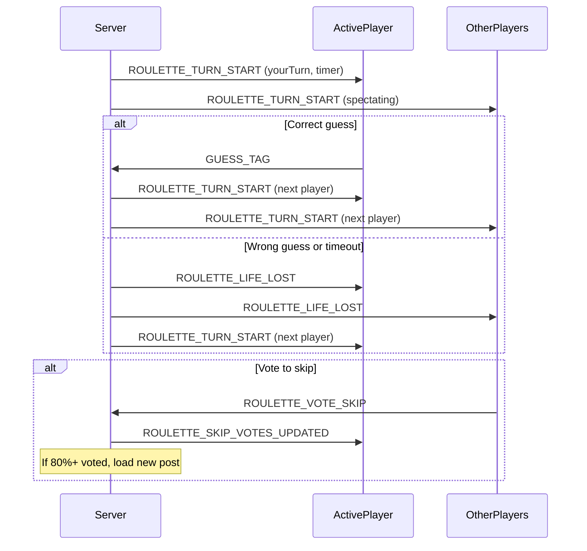

# Roulette Game Mode Implementation

## Current State

Roulette already exists in the `GameMode` enum (`'Blitz' | 'Roulette' | 'Imposter'`) and is selectable in the GameSetup UI, but has **zero gameplay logic** -- it currently behaves identically to Blitz.

The Blitz mode has all players guessing simultaneously with a shared 30-second timer. Roulette is fundamentally different: it is turn-based, one player guesses at a time, and players have lives instead of a shared timer.

## Architecture Overview

Roulette introduces **server-authoritative turn management** -- a major departure from Blitz where the server only validates guesses. The server must track whose turn it is, manage lives, handle vote-to-skip, and advance turns on timeouts.




## New WebSocket Events

Add to `EventType` enum (in both [backend/src/domain/contracts.ts](backend/src/domain/contracts.ts) and [frontend/src/types.ts](frontend/src/types.ts)):

- `**ROULETTE_TURN_START**` -- Server broadcasts: `{ activePlayerID, turnTimeMs, turnOrder, playerLives }`. Tells all clients whose turn it is and resets the active player's timer.
- `**ROULETTE_LIFE_LOST**` -- Server broadcasts: `{ playerID, livesRemaining, reason: 'wrong_guess' | 'timeout' }`. Notifies all clients a player lost a life.
- `**ROULETTE_VOTE_SKIP**` -- Client sends: `{ roomID, userID, vote: boolean }`. Toggle skip vote on/off.
- `**ROULETTE_SKIP_UPDATE**` -- Server broadcasts: `{ skipVotes, totalPlayers, threshold }`. Updated skip vote count.
- `**ROULETTE_PLAYER_ELIMINATED**` -- Server broadcasts: `{ playerID, placement }`. Player has lost all lives.
- `**ROULETTE_ALL_TAGS_GUESSED**` -- Server broadcasts when all tags on a post are guessed, triggering a new post.

## Backend Changes

### 1. Roulette State (`backend/src/state/store.ts`)

Add a new `RouletteGameState` type alongside `ActiveGameState`:

```typescript
export type RouletteGameState = {
  turnOrder: string[];           // shuffled player IDs (the fixed guessing order)
  currentTurnIndex: number;      // index into turnOrder
  playerLives: Map<string, number>; // playerID -> remaining lives
  skipVotes: Set<string>;        // playerIDs who voted to skip
  turnTimerHandle?: NodeJS.Timeout; // server-side timeout for current turn
  totalGuessCount: Map<string, number>; // playerID -> total guesses survived (for ranking)
  eliminationOrder: string[];    // ordered list of eliminated players (first out = last place)
};
```

Store in a new map: `const rouletteGames: Map<string, RouletteGameState> = new Map()` keyed by roomID.

### 2. Roulette Service (`backend/src/services/rouletteService.ts`) -- new file

Core functions:

- `**initRouletteGame(room)**` -- Shuffle alive players into `turnOrder`, initialize `playerLives` (default 3 lives per player), clear `skipVotes`.
- `**startTurn(roomID)**` -- Set a server-side `setTimeout` for the turn duration (e.g. 15 seconds). When it fires, call `handleTurnTimeout`.
- `**handleRouletteGuess(roomID, userID, tag)**` -- Validate it's this player's turn. If correct guess: record it, advance to next alive player. If incorrect: lose a life, advance turn. Broadcast appropriate events.
- `**handleTurnTimeout(roomID)**` -- The active player ran out of time. Lose a life, advance turn.
- `**advanceTurn(roomID)**` -- Move `currentTurnIndex` to next alive player. If all players eliminated, end game. If no more tags, request new post.
- `**handleVoteSkip(roomID, userID, vote)**` -- Add/remove skip vote. If >= 80% of alive players voted skip, trigger new post.
- `**getNextAlivePlayer(state)**` -- Cycle through `turnOrder` to find next player with lives > 0.
- `**handlePlayerElimination(roomID, playerID)**` -- Add to `eliminationOrder`, check if game should end.
- `**handleNewPost(roomID)**` -- Reset `skipVotes`, keep `turnOrder` and lives, continue from current turn position.

### 3. Modify Existing Services

**[backend/src/services/guessService.ts](backend/src/services/guessService.ts):**

- Add a Roulette-specific path that validates it's the guesser's turn before accepting the guess.
- On correct guess in Roulette: don't add score (scoring is by survival), advance turn via `rouletteService`.
- On incorrect guess in Roulette: trigger life loss.

**[backend/src/services/postService.ts](backend/src/services/postService.ts):**

- When `gameMode === 'Roulette'`, after sending a new post, call `rouletteService.startTurn()` instead of relying on the Blitz timer flow.
- Roulette doesn't use `postsPerRound` / `roundsPerGame` in the traditional sense -- the game ends when all players are eliminated. Ignore or reinterpret these settings for Roulette.

**[backend/src/transport/ws/wsRouter.ts](backend/src/transport/ws/wsRouter.ts):**

- Add handlers for `ROULETTE_VOTE_SKIP`.
- Modify `GUESS_TAG` handler to route to Roulette logic when game mode is Roulette.
- When Roulette game starts (first `REQUEST_POST`), initialize Roulette state via `initRouletteGame`.

### 4. Modify Domain Contracts

**[backend/src/domain/contracts.ts](backend/src/domain/contracts.ts)** and **[frontend/src/types.ts](frontend/src/types.ts):**

- Add the new event type strings to the `EventType` enum.
- Add Zod schemas for each new event's data shape (both client-to-server and server-to-client).

## Frontend Changes

### 1. Roulette-Specific Tag List Container

Create a new component `**RouletteTagListContainer`** (or conditionally branch inside [frontend/src/components/TagListContainer.tsx](frontend/src/components/TagListContainer.tsx)) that:

- Listens for `ROULETTE_TURN_START` to know whose turn it is.
- Shows a prominent visual indicator (highlight, glow, "YOUR TURN" banner) when it's the local player's turn.
- **Disables the guess input** when it's not the local player's turn.
- Shows each player's remaining lives (hearts or similar icons) near their name in the in-round leaderboard.
- Manages a **per-turn countdown timer** that resets on each `ROULETTE_TURN_START` (the timer only runs for the active player).
- Shows the guessed tags accumulating (same as Blitz, but one at a time).

### 2. Skip Vote UI

Add a "Vote to Skip" toggle button visible during Roulette gameplay:

- Sends `ROULETTE_VOTE_SKIP` with `vote: true/false`.
- Listens for `ROULETTE_SKIP_UPDATE` to show current vote count (e.g., "2/5 voted to skip").
- Available to all alive players at all times.

### 3. Roulette In-Round Leaderboard

Modify or create a variant of [frontend/src/components/InRoundLeaderboard.tsx](frontend/src/components/InRoundLeaderboard.tsx) for Roulette that shows:

- Player name and icon
- Remaining lives (heart icons)
- Visual highlight on the active player
- Eliminated players shown grayed out

### 4. End Game / Finish Page

Modify [frontend/src/pages/Finish.tsx](frontend/src/pages/Finish.tsx) to handle Roulette rankings:

- Instead of score-based ranking, show players ranked by survival (total guesses survived).
- Last player standing is the winner.

### 5. usePostFetcher / MainPage Integration

**[frontend/src/usePostFetcher.tsx](frontend/src/usePostFetcher.tsx):**

- Listen for `ROULETTE_ALL_TAGS_GUESSED` which triggers a new post load (the server sends a new `REQUEST_POST` automatically).

**[frontend/src/pages/MainPage.tsx](frontend/src/pages/MainPage.tsx):**

- Conditionally render `RouletteTagListContainer` vs. the existing `TagListContainer` based on `gameMode`.
- Skip the leaderboard-between-rounds flow for Roulette (there are no rounds -- the game is continuous until everyone is eliminated).

### 6. GameSetup Considerations

**[frontend/src/pages/GameSetup.tsx](frontend/src/pages/GameSetup.tsx):**

- When Roulette is selected, hide or replace "Posts Per Round" / "Rounds Per Game" with Roulette-specific settings:
  - **Starting Lives** (default 3, range 1-5)
  - **Turn Time** (seconds per turn, default 15, range 5-30)
- These settings need to flow through `CreateRoomEventData` / `UpdateRoomSettingsEventData` (add optional fields to the Zod schemas).

## Key Design Decisions

- **Server-authoritative turns**: The server owns the turn timer via `setTimeout`. This prevents cheating and keeps all clients in sync. The server broadcasts `ROULETTE_TURN_START` which clients use purely for display.
- **Turn order consistency**: The shuffled `turnOrder` array is set once at game start and doesn't change. Dead players are skipped. This guarantees every alive player gets a turn before anyone repeats.
- **Scoring by survival**: Players are ranked by `totalGuessCount` (how many turns they survived). This replaces the score-based system used in Blitz.
- **New post transitions**: When all tags are guessed or 80%+ vote to skip, the server automatically fetches a new post and broadcasts it, then resets skip votes and continues the turn order.
- **No rounds/leaderboard in Roulette**: The game is one continuous session. The `postsPerRound`/`roundsPerGame` settings are hidden for Roulette. The game ends only when all players are eliminated (or only one remains, depending on preference -- the spec says "all players lost all lives").

## Files to Create/Modify

**New files:**

- `backend/src/services/rouletteService.ts` -- Core Roulette game logic

**Modified files:**

- `backend/src/domain/contracts.ts` -- New event types and schemas
- `frontend/src/types.ts` -- Mirror new event types and schemas
- `backend/src/state/store.ts` -- Add `RouletteGameState` and `rouletteGames` map
- `backend/src/transport/ws/wsRouter.ts` -- Route new events, modify GUESS_TAG for Roulette
- `backend/src/services/guessService.ts` -- Roulette-specific guess validation
- `backend/src/services/postService.ts` -- Roulette post flow (auto-advance)
- `frontend/src/components/TagListContainer.tsx` -- Roulette mode rendering branch
- `frontend/src/components/InRoundLeaderboard.tsx` -- Lives display, active player highlight
- `frontend/src/pages/MainPage.tsx` -- Conditional Roulette vs. Blitz rendering
- `frontend/src/pages/GameSetup.tsx` -- Roulette-specific settings (lives, turn time)
- `frontend/src/pages/Finish.tsx` -- Survival-based ranking
- `frontend/src/usePostFetcher.tsx` -- Handle Roulette post transitions
- `frontend/src/useTagListGuesser.tsx` -- Disable local guessing when not player's turn

