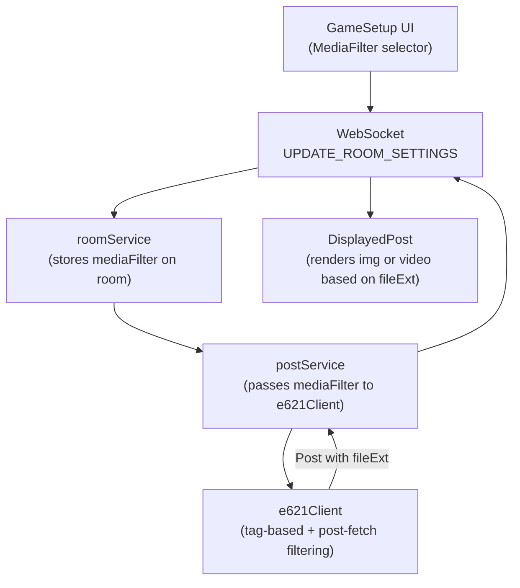

# Animation Support Implementation Plan

## Setting Design

The 7 options the user described map to a single `MediaFilter` enum with values:

| Enum Value              | Description                               |
| ----------------------- | ----------------------------------------- |
| `images_only`           | Only static image posts (current default) |
| `animations_muted`      | Only animations, all muted                |
| `animations_any`        | Only animations, sound allowed            |
| `animations_sound_only` | Only animations that have sound           |
| `both_muted`            | Images + animations, all muted            |
| `both_any`              | Images + animations, sound allowed        |
| `both_sound_only`       | Images + only sound-having animations     |

## Data Flow

## Backend Changes

### 1. Domain Layer - [contracts.ts](backend/src/domain/contracts.ts)

- Add `MediaFilter` Zod enum with the 7 values listed above
- Add `fileExt` field to `Post` schema: `fileExt: z.string()`
- Add `mediaFilter: MediaFilter` to `ServerRoom`
- Add `mediaFilter: MediaFilter` to `ClientRoom`
- Add `mediaFilter: z.optional(MediaFilter)` to `CreateRoomEventData`
- Add `mediaFilter: MediaFilter` to `UpdateRoomSettingsEventData`
- Add `mediaFilter: MediaFilter` to `UpdateRoomSettingsEventDataToClient`
- Export `MediaFilterType`

### 2. e621 Client - [e621Client.ts](backend/src/data/e621Client.ts)

- Accept `mediaFilter` parameter in `getPosts()`
- Remove hardcoded `animated` from `DEFAULT_BLACKLIST_LOCAL` and `DEFAULT_BLACKLIST_PROD` (now controlled by `mediaFilter`)
- Build e621 API tags based on `mediaFilter`:
  - `images_only`: add `-animated`
  - `animations_muted`: add `animated -sound`
  - `animations_any`: add `animated`
  - `animations_sound_only`: add `animated sound`
  - `both_muted`: add `-sound`
  - `both_any`: no animation-related tags
  - `both_sound_only`: no animation tags (requires post-fetch filtering)
- Include `post.file.ext` in the mapped `Post` objects
- Post-fetch filter for `both_sound_only`: after fetching, remove posts where `file.ext` is in `['webm', 'mp4', 'gif']` and `sound` is not in `post.tags.meta`

### 3. Post Service - [postService.ts](backend/src/services/postService.ts)

- Pass `room.mediaFilter` to `getPosts()` alongside `blacklist` and `preferlist`

### 4. Room Service - [roomService.ts](backend/src/services/roomService.ts)

- Add `mediaFilter` parameter to `createOrUpdateRoom()` (default: `'images_only'`)
- Add `mediaFilter` parameter to `updateRoomSettings()`
- Store `mediaFilter` on the room object in both functions

### 5. Room Utils - [roomUtils.ts](backend/src/domain/roomUtils.ts)

- Add `mediaFilter` to the `convertServerRoomToClientRoom` mapping

### 6. WebSocket Router - [wsRouter.ts](backend/src/transport/ws/wsRouter.ts)

- In `CREATE_ROOM` handler: pass `data.mediaFilter` to `createOrUpdateRoom()`
- In `UPDATE_ROOM_SETTINGS` handler: pass `data.mediaFilter` to `updateRoomSettings()` and include it in the broadcast response

### 7. Rooms Repository - [roomsRepo.ts](backend/src/data/repos/roomsRepo.ts)

- Add `media_filter: room.mediaFilter` to the upsert payload (requires a `media_filter` column in Supabase `rooms` table)

## Frontend Changes

### 8. Types - [types.ts](frontend/src/types.ts)

- Mirror all schema changes from backend `contracts.ts`:
  - Add `MediaFilter` enum
  - Add `fileExt` to `Post`
  - Add `mediaFilter` to `ServerRoom`, `ClientRoom`, event data schemas
  - Export `MediaFilterType`

### 9. DisplayedPost Component - [DisplayedPost.tsx](frontend/src/components/DisplayedPost.tsx)

- Accept `mediaFilter` prop (or derive from context) to know whether to mute
- Determine media type from `post.fileExt`:
  - `jpg`, `png` -> render `` (current behavior)
  - `gif` -> render `` (browsers handle GIF natively)
  - `webm`, `mp4` -> render `<video>` with `autoPlay`, `loop`, `playsInline`
- For video elements:
  - Set `muted` attribute when `mediaFilter` contains "muted" (`animations_muted`, `both_muted`)
  - Show native controls when sound is allowed
  - Fire `onImageLoad` equivalent via `onLoadedMetadata` for orientation detection
- Style video elements to match image styling in [displayed-post.module.css](frontend/src/styles/components/displayed-post.module.css)

### 10. GameSetup Page - [GameSetup.tsx](frontend/src/pages/GameSetup.tsx)

- Add `mediaFilter` local state (default: `'images_only'`)
- Add a "Media Type" section in the settings form (similar to Rating section) with a `<Select>` dropdown or button group for the 7 options
- Add `mediaFilter` to `RoomSettingsUpdate` type
- Include `mediaFilter` in `sendRoomSettingsUpdate()` payload
- Sync incoming `mediaFilter` from all room state update events (`JOIN_ROOM`, `READY_UP`, `LEAVE_ROOM`, `UPDATE_ROOM_SETTINGS`)
- Include `mediaFilter` in `createGame()` payload
- Disable selector when not host

### 11. Pass mediaFilter to DisplayedPost

- Thread `mediaFilter` from `GameSetup` -> `MainPage` -> `DisplayedPost` (or use UserContext)
- `MainPage` already receives `currentPost`; add `mediaFilter` prop

## Database Migration

- Add `media_filter TEXT DEFAULT 'images_only'` column to the Supabase `rooms` table

## Testing Considerations

- Update existing `postService` tests to account for the new `mediaFilter` parameter
- Update `roomService` tests for the new field
- Unit test the e621 tag-building logic for each `mediaFilter` value
- Unit test post-fetch filtering logic for `both_sound_only`

